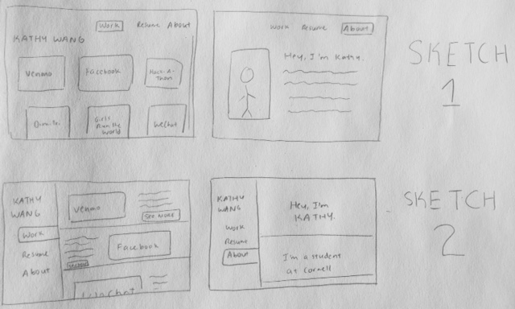

# Project 1, Milestone 1 - Design & Plan

Your Name: Kathy Wang

## Markdown

[**Delete this section before you submit your assignment.**]

This is a Markdown file. All written documents that you will submit this semester will be Markdown files. Markdown is a commonly used format by developers and bloggers. It's something that you should know.

The following links are Markdown references:
* <https://guides.github.com/features/mastering-markdown/>
* <https://github.com/adam-p/markdown-here/wiki/Markdown-Cheatsheet>

When writing your Markdown file in Atom. Open the command palette and search for **Markdown Preview: Toggle**. This will open up a panel in Atom where you can preview your formatted Markdown file.

This is how your insert images into your Markdown documents:

**Tip: The above example image could double for both a sketch and a wireframe.**

## 1. Persona

[1. Pick a persona]

I've selected Abby as my persona.

I've selected Abby as my persona because while it would be nice for my portfolio to be very creative, at the end of the day, I want it to be clear and straightforward. That's why I chose to gear it toward someone like Abby. Since she is both task-oriented and has low computer self-efficacy, I need to ensure that my website has a very clear flow, and that all parts of the interface are straightforward.

## 2. Sketches

[2. Create some sketches to generate ideas about a website design that would work for your persona.]

[Tell us why your sketches meet the needs of your persona. 1-3 sentences]

The main panel remains a constant feature regardless of what page you are on, making it easy to navigate through the site. Furthermore, there are only three pages on both my sketches ("Work", "Resume", and "About"), and each page has minimal scrolling, and does not link elsewhere. These features allow for a simple, but satisfactory experience for the user-- something that someone like Abby would greatly appreciate, given her task-oriented and low computer self-efficacy nature.

[Insert your 2-3 sketches here.]

## 3. Wireframes

[3. Author detailed wireframes that will become the design that you program for the final milestone.]

[Insert your 3-4 wireframes here.]

## 4. Coding Plan & Pseudocode

[4. Author a plan for how you will code your PHP website.]

[Make sure you layout how to you plan to use PHP *includes*.]

[Write your pseudocode for your user defined function.]

Includes: On each page, there is
  a header (header.php) with:
    1) the text "KATHY T. WANG" and
    2) Below that, there are three links ("Work", "Resume", "About") that go to other pages.

  On the first page ("Work"), under the header, there will  be a body that has several containers.
      Each container has several parts:
      1) an image of the logo or representation of the case study,  
      2) a text box with a short description of the case study, and
      3) a button that links the user to another page with the actual content of the case study.

  On the second page ("Resume"), under the header, there is an image of my resume. The user will have the ability to zoom in on my resume.

  On the third page ("About"), under the header, there are three parts in the body:
    1) a personality picture (an image) on the left, and  
    2) a text box with a short description of myself, including my school, career aspirations, interesting facts, and what design means to me.
    3) a "Contact Me" container with a text box that allows the user to input their name and a comment. After the user inputs this information, a message pops up, saying "Thank you [Name], I will reach out to you shortly!"
